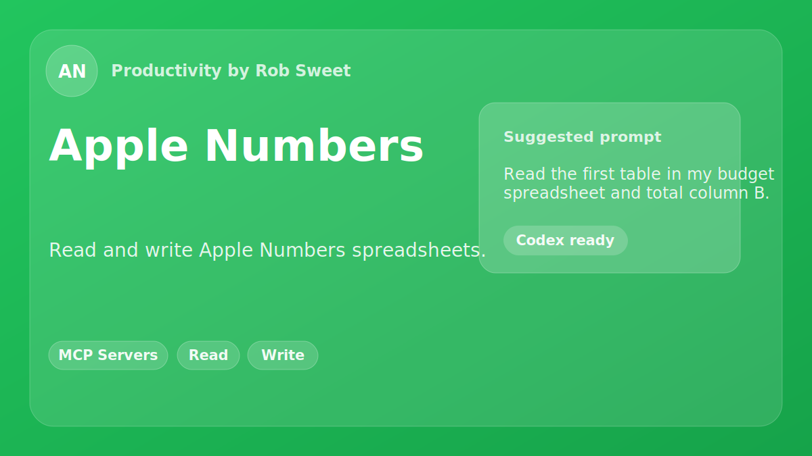

# Apple Numbers MCP Server

A [Model Context Protocol (MCP)](https://modelcontextprotocol.io/) server that enables AI assistants like Claude to read, write, search, and modify Apple Numbers (`.numbers`) spreadsheet files. Backed by the [numbers-parser](https://pypi.org/project/numbers-parser/) Python library.

[](https://www.npmjs.com/package/apple-numbers-mcp)
[](https://github.com/sweetrb/apple-numbers-mcp/actions/workflows/ci.yml)
[](https://opensource.org/licenses/MIT)

<p align="center">
  
</p>

## What is This?

This server acts as a bridge between AI assistants and Apple Numbers spreadsheets. Once configured, you can ask Claude (or any MCP-compatible AI) to:

- "What's in this spreadsheet?" — inspect sheets, tables, dimensions
- "Find every row where the customer is Acme Corp"
- "Export the Q3 Results table to CSV"
- "Set cell B5 to =SUM(B2:B4)"
- "Append these three rows to the Inventory table"
- "Bold and center the header row"
- "Import this CSV into a new spreadsheet"

The AI assistant communicates with this server, which uses [numbers-parser](https://pypi.org/project/numbers-parser/) to read and write `.numbers` files directly (no Numbers.app required for most operations). All data stays local on your machine.

## Quick Start

### Using Claude Code (Easiest)

If you're using [Claude Code](https://claude.com/product/claude-code) (in Terminal or VS Code), just ask Claude to install it:

```
Install the sweetrb/apple-numbers-mcp MCP server so you can help me work with my Numbers spreadsheets
```

Claude will handle the installation and configuration automatically. After install, you'll need to install `numbers-parser` (Python) — see [Requirements](#requirements) below.

### Using the Plugin Marketplace

Install as a Claude Code plugin for automatic configuration and enhanced AI behavior:

```bash
/plugin marketplace add sweetrb/apple-numbers-mcp
/plugin install apple-numbers
```

This method also installs a **skill** that teaches Claude when and how to use Apple Numbers effectively.

### Using the Codex Marketplace

Install the same public marketplace in Codex:

```bash
codex plugin marketplace add sweetrb/apple-numbers-mcp
codex plugin add apple-numbers@apple-numbers-mcp
```

The Codex package registers the `apple-numbers` MCP server through
`npx -y apple-numbers-mcp` — the same published-package invocation documented for
Claude Desktop below — and bundles the Apple Numbers skill guidance. As with every
install path, the `numbers-parser` Python sidecar must be available (`pip3 install
numbers-parser`); see [Requirements](#requirements).

### Other Hosts (Hermes, Antigravity)

Plugin packaging for the Hermes and Antigravity hosts is also included (`.hermes-plugin/` and `.antigravity-plugin/`). Each registers the same `apple-numbers` MCP server (launched via `npx -y apple-numbers-mcp`) and bundles the Apple Numbers skill, so behavior matches the Claude Code and Codex plugins. As with every install path, the `numbers-parser` Python sidecar must be available (`pip3 install numbers-parser`); see [Requirements](#requirements). Install them through each host's plugin/marketplace mechanism pointed at this repository.

### Manual Installation

**1. Install the server:**
```bash
npm install -g github:sweetrb/apple-numbers-mcp
```

**2. Install numbers-parser** (the Python library this server depends on):
```bash
pip3 install numbers-parser
```

Or, if you cloned the repo, run `npm run setup` to create a project-local Python venv with `numbers-parser` pre-installed.

**3. Add to Claude Desktop** (`~/Library/Application Support/Claude/claude_desktop_config.json`):
```json
{
  "mcpServers": {
    "apple-numbers": {
      "command": "npx",
      "args": ["apple-numbers-mcp"]
    }
  }
}
```

**4. Restart Claude Desktop** and start using natural language:
```
"What sheets are in ~/Documents/budget.numbers?"
```

#### Running from a clone in Claude Code (project-scope `.mcp.json`)

This repo ships a `.mcp.json` at its root so that, when you run `claude` from inside a clone, the server is registered automatically as a **project-scope** server — no manual config needed. Before launching, run **both**:

```bash
npm run build    # compile TypeScript to build/
npm run setup    # create the ./venv the Python sidecar needs
```

`npm run setup` is required because this is a Python-sidecar server: it shells out to `./venv/bin/python3` running `numbers-parser`. Without the venv, the server starts but every tool call fails. Then launch Claude Code from the repo directory and approve the server when prompted.

The entrypoint is written as:

```json
"args": ["${CLAUDE_PROJECT_DIR:-.}/build/index.js"]
```

`CLAUDE_PROJECT_DIR` is the variable Claude Code injects into a project/user-scoped server's environment, and it resolves to the repo root. **You must launch `claude` from inside the repo** for this to work — the bare `.` fallback is only a last resort and is *not* reliable, because it resolves against the launching process's working directory, not the repo.

> **Why not `${CLAUDE_PLUGIN_ROOT}`?** `CLAUDE_PLUGIN_ROOT` is set **only** for marketplace plugin installs, never for a project-scope clone, so it can't drive the clone workflow. Conversely, a plugin install can't use `CLAUDE_PROJECT_DIR` (in a plugin, that points at the *user's* project, not the plugin's own directory). Claude Code does **not** support nested defaults like `${CLAUDE_PLUGIN_ROOT:-${CLAUDE_PROJECT_DIR:-.}}`, so a single entrypoint string cannot serve both contexts. The two distribution paths are therefore decoupled: the **plugin** carries its own MCP config in `.claude-plugin/plugin.json` (using `${CLAUDE_PLUGIN_ROOT}`), while the root `.mcp.json` is dedicated to the **clone** workflow (using `${CLAUDE_PROJECT_DIR:-.}`). Because `plugin.json` declares its own `mcpServers`, the plugin does not also auto-load the root `.mcp.json`, so there is no double-registration.

> **Heads-up on scope precedence:** project-scope (`.mcp.json`) outranks user-scope. If you *also* have an `apple-numbers` entry registered at user scope (e.g. an absolute path in `~/.claude.json`), the project-scope entry wins and the user-scope one is ignored entirely. Pick one — for local development on this repo, the project-scope `.mcp.json` is the intended source. To pin a specific local build instead, register it at **local** scope (`claude mcp add apple-numbers -s local -- node /abs/path/build/index.js`), which outranks project scope.

## Requirements

- **macOS or Linux** — `numbers-parser` reads the file format directly, so most tools work anywhere. **Formatting and formula tools require macOS with Numbers.app.**
- **Node.js 20+** — Required for the MCP server
- **Python 3.9+ with numbers-parser** — Install via `pip3 install numbers-parser` or via `npm run setup` if installing from source
- **Automation permission (writes only)** — Reads and exports need no special permission, but write/format tools drive Numbers.app via AppleScript and require the host app to have Automation permission for Numbers, granted on first use. See the [Automation Permission guide](docs/AUTOMATION-PERMISSION.md). Run the **`doctor`** tool to verify your setup.

## Features

### Read

| Feature | Description |
|---------|-------------|
| **File Inspection** | List sheets, tables, dimensions, and header rows |
| **Table Read** | Read data with optional row range and column filtering |
| **Cell Read** | Single cells by 0-based index, with optional formula/format/merge metadata |
| **Search** | Case-insensitive text search across every cell, optionally scoped to one sheet |
| **Export** | Export a table to CSV, TSV, or JSON |

### Write

| Feature | Description |
|---------|-------------|
| **Create Spreadsheet** | New `.numbers` file with headers and optional initial rows |
| **Set Cell** | Write a value to a single cell, with optional type coercion |
| **Set Cells Batch** | Write many cells in one operation (more efficient than multiple set-cell calls) |
| **Add / Update / Delete Rows** | Append, replace, or remove rows by index |
| **Sheets and Tables** | Add new sheets or tables to an existing file; rename either |

### Formulas (requires Numbers.app)

| Feature | Description |
|---------|-------------|
| **Set Formula** | Write a formula like `=SUM(B2:B10)` to a cell |
| **Set Formulas Batch** | Write many formulas at once |

### Formatting (requires Numbers.app)

| Feature | Description |
|---------|-------------|
| **Cell Styles** | Font, size, colors, number format, alignment |
| **Cell Styles Batch** | Style many cells at once |
| **Column Width / Row Height** | Set dimensions in pixels |
| **Merge / Unmerge** | Merge a range of cells, or undo a merge |

### Import / Diagnostics

| Feature | Description |
|---------|-------------|
| **Import CSV/TSV/JSON** | Convert a tabular file into a new `.numbers` spreadsheet |
| **Health Check** | Verify Python 3 and numbers-parser are installed |
| **Doctor** | Richer setup diagnostic — read sidecar, Numbers.app, and Automation permission, each reported ok / warn / fail with actionable advice |

All tools also return **structured JSON** (`structuredContent`) alongside the human-readable text, so agents can consume results without parsing prose.

### MCP resources & prompts

Resources expose read-only context the client can attach without a tool call:
the `numbers://file/{path}` template (file structure — sheets, tables, dimensions,
headers) and the `numbers://table/{path}` template (the default table's data).
Both are templated by a URL-encoded `.numbers` file path. Prompts package common
workflows: `analyze-spreadsheet`, `bulk-edit`, `import-csv-guide`.

---

## Tool Reference

This section documents all available tools. AI agents should use these tool names and parameters exactly as specified.

### Read

#### `health-check`

Verify Python 3 and `numbers-parser` are installed and reachable from the server.

**Parameters:** None
**Returns:** `numbers-parser` version, or an error explaining how to install.

---

#### `doctor`

Run a full setup diagnostic with three separate checks: `numbers_parser` (the read sidecar — required for all reads/exports), `numbers_app` (Numbers.app present — required for write/format tools), and `automation_permission` (an informational reminder that write tools need Automation permission for Numbers.app). Each is reported as ok / warn / fail with actionable advice. This is the richer counterpart to `health-check`; reach for it first when a tool returns a permission or setup error.

**Parameters:** None

**Returns:** A per-check report. The `structuredContent` carries the raw `{ healthy, checks[] }`, where each check has `name`, `status` (`ok`/`warn`/`fail`), and `detail`. Reads don't need Automation permission, but writes do — see [docs/AUTOMATION-PERMISSION.md](docs/AUTOMATION-PERMISSION.md).

---

#### `get-file-info`

Get the structure of a `.numbers` file: sheets, tables, dimensions, header rows.

| Parameter | Type | Required | Description |
|-----------|------|----------|-------------|
| `path` | string | Yes | Absolute or `~`-relative path to the `.numbers` file |

**Returns:** Default sheet name, plus each sheet with its tables (name, dimensions, header row).

---

#### `read-table`

Read data from a table. Returns headers and rows. Defaults to the first sheet and first table if not specified.

| Parameter | Type | Required | Description |
|-----------|------|----------|-------------|
| `path` | string | Yes | Path to the `.numbers` file |
| `sheet` | string | No | Sheet name (default: first sheet) |
| `table` | string | No | Table name (default: first table) |
| `startRow` | number | No | 0-based start row, inclusive (default: 1, after header) |
| `endRow` | number | No | 0-based end row, inclusive (default: last row) |
| `columns` | (string \| number)[] | No | Column filter: header names or 0-based indices |

---

#### `get-cell`

Read a single cell value by row and column index (0-based).

| Parameter | Type | Required | Description |
|-----------|------|----------|-------------|
| `path` | string | Yes | Path to the `.numbers` file |
| `sheet` | string | Yes | Sheet name |
| `table` | string | Yes | Table name |
| `row` | number | Yes | Row index (0-based) |
| `col` | number | Yes | Column index (0-based) |
| `verbose` | boolean | No | Include formula, formatted value, and merge info |

---

#### `search`

Case-insensitive partial match across every cell in a `.numbers` file.

| Parameter | Type | Required | Description |
|-----------|------|----------|-------------|
| `path` | string | Yes | Path to the `.numbers` file |
| `query` | string | Yes | Text to search for |
| `sheet` | string | No | Limit search to one sheet |

**Returns:** Each match with sheet, table, row, column header, and value.

---

#### `export-table`

Export a table to CSV, TSV, or JSON.

| Parameter | Type | Required | Description |
|-----------|------|----------|-------------|
| `path` | string | Yes | Path to the `.numbers` file |
| `format` | `"csv" \| "tsv" \| "json"` | Yes | Output format |
| `outputPath` | string | Yes | Path for the output file |
| `sheet` | string | No | Sheet name (default: first sheet) |
| `table` | string | No | Table name (default: first table) |

---

### Write

#### `create-spreadsheet`

Create a new `.numbers` file with one sheet and table.

**⚠️ Safety:** Overwrites the file at `path` if it already exists — confirm the destination first.

| Parameter | Type | Required | Description |
|-----------|------|----------|-------------|
| `path` | string | Yes | Path for the new file |
| `headers` | string[] | Yes | Column header names |
| `rows` | (string \| number \| boolean \| null)[][] | No | Initial data rows |
| `sheetName` | string | No | Default: `"Sheet 1"` |
| `tableName` | string | No | Default: `"Table 1"` |

---

#### `set-cell`

Write a value to a single cell.

**⚠️ Safety:** Overwrites the existing cell value in place in the `.numbers` file.

| Parameter | Type | Required | Description |
|-----------|------|----------|-------------|
| `path` | string | Yes | Path to the `.numbers` file |
| `row` | number | Yes | Row index (0-based) |
| `col` | number | Yes | Column index (0-based) |
| `value` | string \| number \| boolean \| null | Yes | Value to write |
| `sheet` | string | No | Sheet name (default: first sheet) |
| `table` | string | No | Table name (default: first table) |
| `type` | `"string" \| "number" \| "boolean" \| "date"` | No | Force value type (default: auto-detect) |

---

#### `set-cells-batch`

Write multiple cells in a single operation. Much more efficient than multiple `set-cell` calls.

**⚠️ Safety:** Overwrites the existing cell values in place in the `.numbers` file.

| Parameter | Type | Required | Description |
|-----------|------|----------|-------------|
| `path` | string | Yes | Path to the `.numbers` file |
| `updates` | array | Yes | Array of `{row, col, value, type?}` objects |
| `sheet` | string | No | Sheet name |
| `table` | string | No | Table name |

---

#### `add-rows`

Append rows of data after the last existing row.

| Parameter | Type | Required | Description |
|-----------|------|----------|-------------|
| `path` | string | Yes | Path to the `.numbers` file |
| `rows` | array[] | Yes | Rows to append (one array per row) |
| `sheet` | string | No | Sheet name |
| `table` | string | No | Table name |

---

#### `update-rows`

Write full rows by index. Each update is a complete row replacement.

**⚠️ Safety:** Overwrites the existing row data in place in the `.numbers` file.

| Parameter | Type | Required | Description |
|-----------|------|----------|-------------|
| `path` | string | Yes | Path to the `.numbers` file |
| `updates` | array | Yes | Array of `{row, values}` objects |
| `sheet` | string | No | Sheet name |
| `table` | string | No | Table name |

---

#### `delete-rows`

Delete a range of rows by 0-based inclusive indices.

**⚠️ Safety:** Destructive and not undoable — requires explicit user confirmation. Modifies the `.numbers` file in place; verify the row range first.

| Parameter | Type | Required | Description |
|-----------|------|----------|-------------|
| `path` | string | Yes | Path to the `.numbers` file |
| `startRow` | number | Yes | First row to delete (0-based, inclusive) |
| `endRow` | number | Yes | Last row to delete (0-based, inclusive) |
| `sheet` | string | No | Sheet name |
| `table` | string | No | Table name |

---

### Sheets and Tables

#### `add-sheet`

Add a new sheet, optionally with headers for the default table.

| Parameter | Type | Required | Description |
|-----------|------|----------|-------------|
| `path` | string | Yes | Path to the `.numbers` file |
| `sheetName` | string | Yes | Name for the new sheet |
| `tableName` | string | No | Name for the default table |
| `headers` | string[] | No | Headers for the default table |

---

#### `add-table`

Add a new table to an existing sheet.

| Parameter | Type | Required | Description |
|-----------|------|----------|-------------|
| `path` | string | Yes | Path to the `.numbers` file |
| `sheet` | string | No | Sheet name (default: first sheet) |
| `tableName` | string | No | Name for the new table |
| `headers` | string[] | No | Column headers |

---

#### `rename-sheet` / `rename-table`

Rename a sheet or table.

| Parameter | Type | Required | Description |
|-----------|------|----------|-------------|
| `path` | string | Yes | Path to the `.numbers` file |
| (rename-sheet) `oldName` / `newName` | string | Yes | Current and new sheet name |
| (rename-table) `sheet` | string | No | Sheet containing the table |
| (rename-table) `oldName` / `newName` | string | Yes | Current and new table name |

---

### Formulas (requires Numbers.app)

#### `set-formula`

Write a formula to a cell.

| Parameter | Type | Required | Description |
|-----------|------|----------|-------------|
| `path` | string | Yes | Path to the `.numbers` file |
| `sheet` | string | Yes | Sheet name |
| `table` | string | Yes | Table name |
| `row` | number | Yes | 0-based row |
| `col` | number | Yes | 0-based column |
| `formula` | string | Yes | Formula text including the leading `=` |

---

#### `set-formulas-batch`

Write multiple formulas in a single operation.

| Parameter | Type | Required | Description |
|-----------|------|----------|-------------|
| `path` | string | Yes | Path to the `.numbers` file |
| `sheet` | string | Yes | Sheet name |
| `table` | string | Yes | Table name |
| `entries` | array | Yes | Array of `{row, col, formula}` objects |

---

### Formatting (requires Numbers.app)

#### `set-cell-style`

Apply font, color, number format, and alignment to a single cell.

| Parameter | Type | Required | Description |
|-----------|------|----------|-------------|
| `path` | string | Yes | Path to the `.numbers` file |
| `sheet` | string | Yes | Sheet name |
| `table` | string | Yes | Table name |
| `row` | number | Yes | 0-based row |
| `col` | number | Yes | 0-based column |
| `style` | object | Yes | `{font?, fontSize?, color?, fillColor?, bold?, italic?, alignment?, numberFormat?, ...}` |

---

#### `set-cells-style-batch`

Apply styles to multiple cells in a single operation.

| Parameter | Type | Required | Description |
|-----------|------|----------|-------------|
| `path` | string | Yes | Path to the `.numbers` file |
| `sheet` | string | Yes | Sheet name |
| `table` | string | Yes | Table name |
| `entries` | array | Yes | Array of `{row, col, style}` objects |

---

#### `set-column-width` / `set-row-height`

Set the width of a column or height of a row in pixels.

| Parameter | Type | Required | Description |
|-----------|------|----------|-------------|
| `path` | string | Yes | Path to the `.numbers` file |
| `sheet` | string | Yes | Sheet name |
| `table` | string | Yes | Table name |
| `col` (column) / `row` (row) | number | Yes | 0-based index |
| `width` (column) / `height` (row) | number | Yes | Size in pixels |

---

#### `merge-cells` / `unmerge-cells`

Merge a rectangular range of cells, or undo a merge.

| Parameter | Type | Required | Description |
|-----------|------|----------|-------------|
| `path` | string | Yes | Path to the `.numbers` file |
| `sheet` | string | Yes | Sheet name |
| `table` | string | Yes | Table name |
| `startRow`, `startCol`, `endRow`, `endCol` | number | Yes | 0-based corners (inclusive) |

---

### Import

#### `import-csv`

Import a CSV, TSV, or JSON file into a new `.numbers` spreadsheet. Auto-detects format from extension, or pass `format` explicitly.

**⚠️ Safety:** Overwrites the file at `outputPath` if it already exists — confirm the destination first.

| Parameter | Type | Required | Description |
|-----------|------|----------|-------------|
| `inputPath` | string | Yes | Path to the CSV/TSV/JSON input |
| `outputPath` | string | Yes | Path for the output `.numbers` file |
| `format` | `"auto" \| "csv" \| "tsv" \| "json"` | No | Default: auto-detect from extension |
| `sheetName` | string | No | Default: `"Sheet 1"` |
| `tableName` | string | No | Default: `"Table 1"` |

---

## Usage Patterns

### Basic Workflow

```
User: "What's in ~/Documents/budget.numbers?"
AI: [calls get-file-info]
    "It has 3 sheets: Q1, Q2, Q3. Q1 contains a 'Budget' table with 12 rows × 5 columns..."

User: "Show me Q3"
AI: [calls read-table with sheet='Q3']
    "Q3 / Budget (12 rows × 5 cols): ..."

User: "Find every line about Acme Corp"
AI: [calls search with query='Acme Corp']
    "Found 4 matches in Q1/Budget and Q3/Vendors..."
```

### Iterative Edits

```
User: "Set B5 to =SUM(B2:B4) and bold the header row"
AI: [calls set-formula] [calls set-cells-style-batch with bold:true on row 0]
    "Done — B5 is =SUM(B2:B4) and the header row is bold."
```

### Importing CSV

```
User: "Import ~/Downloads/customers.csv into a new spreadsheet"
AI: [calls import-csv with inputPath, outputPath]
    "Imported 240 rows (6 columns) into ~/Documents/customers.numbers"
```

---

## Installation Options

### npm (Recommended)

```bash
npm install -g github:sweetrb/apple-numbers-mcp
pip3 install numbers-parser
```

### From Source (with Project-Local venv)

```bash
git clone https://github.com/sweetrb/apple-numbers-mcp.git
cd apple-numbers-mcp
npm install
npm run setup    # creates ./venv and installs numbers-parser
npm run build
```

If installed from source, use this configuration:
```json
{
  "mcpServers": {
    "apple-numbers": {
      "command": "node",
      "args": ["/absolute/path/to/apple-numbers-mcp/build/index.js"]
    }
  }
}
```

The server prefers a project-local venv at `./venv/bin/python3` if present, and falls back to system `python3`. Global npm install works fine as long as `numbers-parser` is on the system Python.

---

## Configuration

All configuration is optional — the server works out of the box.

### Environment variables

| Variable | Default | Description |
|----------|---------|-------------|
| `APPLE_NUMBERS_MCP_MAX_BUFFER` | 50 MB (Python reader) / 64 MB (AppleScript) | Max bytes captured from a subprocess's stdout, applied to both the Python reader and the AppleScript layer. Raise it if a very large spreadsheet is truncated; lower it to cap memory. |
| `APPLE_NUMBERS_MCP_CONFIG_FILE` | `~/Library/Application Support/apple-numbers-mcp/config.json` | Path to the JSON config file (see below). |

### Configuration file (when the host strips `env`)

Some host apps (e.g. Claude Desktop) launch the MCP server with a scrubbed
environment and ignore the `env` block in their server config, so there's no way
to pass `APPLE_NUMBERS_MCP_*` settings through it. In that case, put them in a JSON
file the host doesn't manage — `APPLE_NUMBERS_MCP_CONFIG_FILE`, or by default
`~/Library/Application Support/apple-numbers-mcp/config.json`:

```json
{
  "APPLE_NUMBERS_MCP_MAX_BUFFER": "104857600"
}
```

The server reads it at startup and merges string values into the environment
**without overriding** anything already set there (so an explicit `env` still
wins). Keep only non-secret config here.

---

## Architecture

This package is a **TypeScript MCP server with a Python sidecar**:

- The MCP server (Node) speaks the Model Context Protocol over stdio.
- A bundled Python script (`src/utils/numbers_reader.py`) uses `numbers-parser` to read and write `.numbers` files and returns JSON.
- For formatting, formulas, and cell-dimension changes, an AppleScript layer (`src/utils/applescript.ts`) drives Numbers.app directly — `numbers-parser` doesn't write styles.
- TypeScript spawns Python via `child_process.execFileSync`.

This is the same Python-sidecar pattern used by [apple-photos-mcp](https://github.com/sweetrb/apple-photos-mcp) for the `osxphotos` library.

---

## Security and Privacy

- **Local only** — All operations happen on the local machine. No data is sent to external servers.
- **No credential storage** — The server doesn't store any passwords or authentication tokens.
- **File-system access** — Tools take explicit paths; the server only reads or writes files you name.
- **Numbers.app automation** — Formatting and formula tools drive Numbers.app via AppleScript. macOS will prompt for automation permission on first use.

---

## Known Limitations

For the full rundown — the read-vs-write split, AppleScript-only formulas/styles,
indexing, dates, format lag, and concurrent edits — see **[docs/LIMITATIONS.md](docs/LIMITATIONS.md)**.
The summary below is the quick version.

| Limitation | Reason |
|------------|--------|
| Formatting / formulas / dimensions need Numbers.app | `numbers-parser` doesn't write styles or formulas; the AppleScript layer fills that gap (macOS only) |
| No conditional formatting | Not exposed by `numbers-parser` |
| No charts or images | Not exposed by `numbers-parser` |
| Sheet deletion not supported | Not exposed by `numbers-parser` |
| Computed-value writes only | `set-cell` / `add-rows` etc. write computed values; use `set-formula` to write formulas |
| Date filter format | ISO 8601 (`YYYY-MM-DD` or full ISO datetime) |

These are tracked for future releases. The underlying `numbers-parser` library has partial support for styles via its `Style` API, which provides a path forward for some of these.

---

## Troubleshooting

### "numbers-parser not installed. Run: npm run setup"
- Run `pip3 install numbers-parser` (global) or `npm run setup` (project-local venv).
- If you used a virtualenv, make sure it's the one at `./venv/` in the project directory.

### `apple-numbers` server fails to connect when run from a clone
- Launch `claude` from inside the repo directory so `CLAUDE_PROJECT_DIR` resolves to the repo root (the bare `.` fallback is unreliable).
- Run **both** `npm run build` and `npm run setup` first — `build` compiles the entrypoint, `setup` creates the `./venv` the Python sidecar needs.
- Run `claude mcp list` to check for conflicting scopes; project-scope `.mcp.json` outranks a user-scope `apple-numbers` entry, and a local-scope entry outranks both.
- If the server is listed as pending, approve the project-scope server when Claude Code prompts.

### "File not found"
- Check the path; expand `~` if your shell isn't doing it.
- Ensure the file extension is `.numbers`.

### Formatting / formula tools fail with "Numbers.app not running" or "Not authorized to send Apple events to Numbers"
- Open Numbers.app at least once. macOS will prompt for automation permission — accept it.
- Verify in **System Settings → Privacy & Security → Automation**, or reset with `tccutil reset AppleEvents`.
- Run the **`doctor`** tool to confirm your setup — it reports the Numbers.app and Automation-permission checks separately. See the [Automation Permission guide](docs/AUTOMATION-PERMISSION.md). Reads don't need this permission; only writes do.

### Output looks wrong (dates as ISO, floats with decimals)
- The server normalizes dates to ISO 8601 and rounds floats that are within `1e-9` of an integer. If you want raw values, file an issue.

---

## Development

```bash
npm install              # Install dependencies
npm run setup            # Create ./venv with numbers-parser
npm run build            # Compile TypeScript
npm test                 # Unit tests (mocked)
npm run test:integration # Integration tests against real .numbers fixtures
npm run test:all         # Both
npm run test:coverage    # Unit tests with coverage report
npm run typecheck        # Type-check without emitting
npm run lint             # Check code style
npm run format           # Format code
```

### Integration tests

Integration tests exercise the full pipeline against real `.numbers` fixture files. Generate the fixtures first, then run:

```bash
npm run setup
./venv/bin/python3 test/fixtures/generate-fixtures.py
npm run test:all
```

Unit tests run everywhere; integration tests auto-skip when fixtures or `numbers-parser` are not available.

---

## Author

**Rob Sweet** - President, [Superior Technologies Research](https://www.superiortech.io)

A software consulting, contracting, and development company.

- Email: rob@superiortech.io
- GitHub: [@sweetrb](https://github.com/sweetrb)

## License

MIT License - see [LICENSE](LICENSE) for details. This project is not affiliated with Apple Inc. or the [numbers-parser](https://pypi.org/project/numbers-parser/) project.

## Contributing

Contributions are welcome! Please open an issue or PR at [github.com/sweetrb/apple-numbers-mcp](https://github.com/sweetrb/apple-numbers-mcp).

## Related Projects

Part of a family of macOS MCP servers:

- [apple-mail-mcp](https://github.com/sweetrb/apple-mail-mcp) — MCP server for Apple Mail (read, search, send, and organize email)
- [apple-notes-mcp](https://github.com/sweetrb/apple-notes-mcp) — MCP server for Apple Notes (create, search, update, and export notes)
- [apple-photos-mcp](https://github.com/sweetrb/apple-photos-mcp) — MCP server for Apple Photos (query metadata and export originals)
- [numbers-parser](https://pypi.org/project/numbers-parser/) — The Python library that powers this server

## Recurring macOS permission prompts

If macOS keeps re-prompting for Full Disk Access or Automation for `node` (often after a `brew upgrade`), see [docs/NODE-RUNTIME-AND-TCC-PERMISSIONS.md](docs/NODE-RUNTIME-AND-TCC-PERMISSIONS.md) — the fix is to run this server under the official, Developer-ID-signed Node so the grant survives Node updates.
